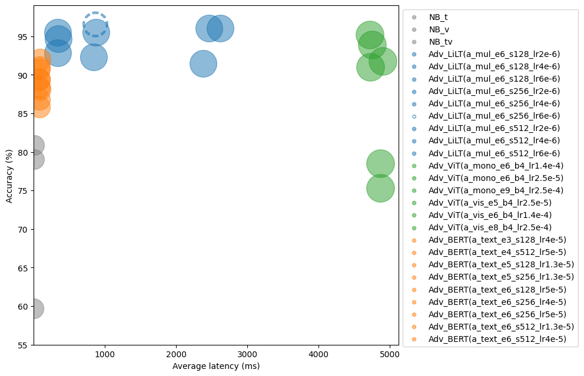

# Offer Slide Classification

## Introduction

This project leverages a machine learning solution to automatically classify presentation slides (.pptx) by analyzing both text and images, aiming to **verify results in organizations from searching** and **reduce manual labeling**.

## Objectives

- Integrate textual and visual information for slide classification.
- Evaluate and compare baseline and advanced machine learning models.
- Conclude optimal parameters combination for baseline and advanced approaches.
- Established docker script for CI/CD pipeline.

## Key Tool & Libraries Used

- [`python_pptx`](https://python-pptx.readthedocs.io/en/latest/) for handling presentation slides (.pptx)
- [`plotly`](https://github.com/plotly/plotly.py) & [`seaborn`](https://seaborn.pydata.org/tutorial.html) for exploratory data analysis.
- [`NLTK`](https://www.nltk.org/) for nature language processing.
- [`sklearn`](https://github.com/scikit-learn/scikit-learn) for feature extraction and selection, baseline classifier, and model evaluation, etc.
- Used text dection algorithms by [`mmocr`](https://github.com/open-mmlab/mmocr) for visual preprocessing.
- [`torch`](https://github.com/pytorch/pytorch) for deep learning model development.
- 🤗 [`Transformers`](https://huggingface.co/models) for pre-trained model leveraging.

## Dataset

The dataset for analyzing the offer reference contains 26,485 slide images (size around **6 GB**). Approximately 14% of the total images were comprised of 3,763 images divided into **12 categories**. Samples were selected using stratified random sampling to ensure it was heterogeneous and representative of the entire dataset, considering attributes such as slide categories.

| Category | Index Number | Number of Samples |
| :-- | --: |--:|
| Working Package Examples  | 10 | 668 |
| Working Package Description | 9| 564|
| Reference Details|6|407|
| Consultant Profile|1|370|
|Offer Title|4|365|
|Project Calculation|5|304|
|Initial & Target Situation|2|225|
|Working Package Overview|7|215|
|Compentencies|0|189|
|Target Situation|8|103|
|Initial Situation|3|86|

## Techniques Covered

- **Feature Processing For Baseline Approach**: Three modalities to obtain rich information from presentation slides are **text**, **vision**, and **multi-modal**.

| Approach  | Modalities  | Feature Extraction               | Feature Selection |
|-----------|-------------|----------------------------------|-------------------|
| baseline | Text        | bag of words, TF-IDF             | chi-square test   |
| baseline  | Vision      | shape types as feature vector    | chi-square test   |
| baseline  | Multi-modal | feature union (Text & Vision)    | chi-square test   |

- **Model Development**: Leveraging advanced approaches with Transformers, including text-based, vision-based, and multi-modal models.

| Model Name | Modality | Sequence Manipulation |Pretrained Model|
| :-- | :-- |:--|:--|
|BERT |Text| split sequence into pieces|[`bert-base-multilingual-cased`](https://huggingface.co/google-bert/bert-base-multilingual-cased)|
|ViT| Vision| geometry processing|[`vit-large-patch16-384`](https://huggingface.co/google/vit-large-patch16-384)|
|LiLT|Multi-modal| bi-directional attention complementation mechanism|[`lilt-xlm-roberta-base`](https://huggingface.co/nielsr/lilt-xlm-roberta-base)|

- **Performance Metrics**: Criteria for evaluating model performance such as F1-Score, Precision, Recall, Average Latency.

## Experiments and Results

Overview of experimental setup, model fine-tuning, and evaluation results. Highlights the superiority of multi-modal information processing in slide classification tasks.

## How to Use

Instructions on how to set up the environment, train the models, and classify new slides.

## Contributing

Guidelines for contributing to the project, including how to submit issues and pull requests.

## License

Details of the project's license.

## Acknowledgments

Gratitude expressed towards advisors, contributors, and any supporting institutions.
